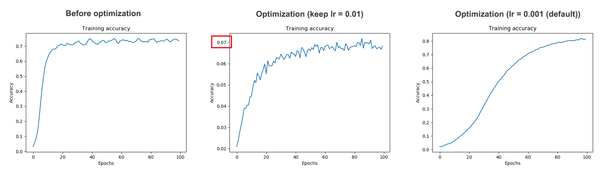
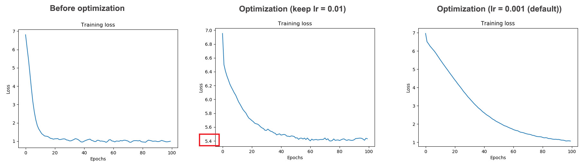

Deep Learning with TensorFlow - Natural Language Processing (NLP) - Tutorials
================
Codes courtesy from TensorFlow in Practice Specialization by deeplearning.ai on Coursera, modified by Tran Nguyen.

Quick notes from the courses + codes to run in Mac terminal. If you want to learn more about TensorFlow, check out the great courses in the "TensorFlow in Practice Specialization" by deeplearning.ai on Coursera.

The codes work well with TensorFlow 2.0

``` bash
pip install tensorflow==2.0.0-alpha0
```

Ref: <https://keras.io/preprocessing/text/>

\*\* Problem with the natural language processing problem: It's difficult to avoid overfitting since there will be always new data in the validation set.

#### 1. Text Processing with Tokenizer

-   Codes: tokenizer\_basics.py
-   What you will learn: (i) Generating a corpus from a list of sentences using Tokenizer. (ii) Converting a list of sentences into a sequence of word index from the corpus. (iii) Using padding to get the list of all the sequences that have the same size.

#### 2.Text Processing for .json Data

-   Codes: text\_processing\_json.py
-   What you will learn: (i) Getting data from json file and tokenize the dataset.

#### 3. Tokenizing the BBC News Dataset

-   Codes: text\_processing\_bcc\_data.py
-   Input: a folder 'bbc' contains 5 folders of 5 different classes (business, entertainment, politics, sport, tech). Each class has mutiple text files of news.
-   Ouput: a corpus for each class, and all the sequences of word-index generated from specific corpus for each of the 5 classes.
-   What you will learn: (i) Reading multiple files from folder. (ii) Tokenizing a dataset with removing a list of common stopwords.
-   Stopwords: common words, do not contribute to the meaning of a sentence =&gt; should be filtered out from the sentences before processing. Stopword list is usually customized for each specific problem.

#### 4. NLP with IMDB Dataset

-   Codes: NLP\_imdb\_dataset.py
-   What you will learn: (i) loading data from tensorflow\_datasets (ii) Tokenizing the dataset of movie reviews. (iii) Embeddings the data to establish meaning of word in a mathematical way: Words were mapped to vectors in higher dimensional space, and the semantics of the words then learned when those words were labelled with similar meaning.E.g., embedding\_dim = 16 =&gt; every word is mapped to a vector in a 16-dimensional space (a vector with 16 elements). (iv) Export the tsv file of words and their vectors for visualization with Embedding Projector, an online tools for word sentiment visualization. meta.tsv contains all the common words; and the vector.tsv contains these words' multidemensional vectors, respectively.

#### 5. Word Sentiment Visualization with Embedding Projector

-   Codes: Input files obtained from Session 4.
-   What you will learn:
-   Embedding Projector can be access through <https://projector.tensorflow.org/>.
-   Click `Load` to load the tsv file of vectors and tsv file of metadata. (If the files have 0 bytes, Embedding Projector will not give any notification; it's just loading forever!)
-   Click `Sphereize data` to visualize the word sentiment.
-   The dimensionalities of the "positive"" sentiment words "point" to a particular way, whereas those with "negative"" sentiment "point" in a different direction.


#### 6. NLP with Sarcasm Dataset

-   Codes: NLP\_sarcasm\_dataset.py
-   What you will learn: (i) Practicing all the concepts mentioned above. (ii) Plotting loss and accuracy. (ii) Perform prediction on a specific sentence.

-   When using number of epochs = 30, for this dataset, the result looks good: All the words in the corpus were classified well as showed in the Embedding Projector:


#### 7. Sub word Tokenization

-   Codes: NLP\_imdb\_dataset\_subword.py
-   What you will learn: (i) Built-in subword corpus ("imdb\_reviews/subwords8k") with some function: encode(): converting string to number decode(): converting number back to string

1.  Using tf.keras.layers.GlobalAveragePooling1D() instead of tf.keras.layers.Flatten() to handle large Embedding on subwords.

#### 8. NLP - Sequence Models with Subword

-   Sequence make a large difference when determining semantics of language since the order in which words appear dictate their impact on the meaning of the sentence.
-   Codes: NLP\_sequence\_model\_imdb\_subword.py
-   What you will learn:

1.  When words are broken down into subwords, the sequence of subwords is very important for the subwords' meaning.
2.  General ideas about recurrent neural networks (RNNs). RNNs carry meaning from one cell to the next =&gt; provide the impact of sequence on meaning.
3.  LSTM (long short-term memory): an update to RNNs. Values from earlier words can be carried to later ones via a cell state =&gt; LSTM help understand meaning when words that qualify each other aren’t necessarily beside each other in a sentence
4.  Bidirectional keras layer can make the cell states of LSTM go in both direction (forward and backward in sequence).
5.  Try implementing different models:

-   using single layer LSTM

``` r
model = tf.keras.Sequential([
        tf.keras.layers.Embedding(corpus_size, embedding_dim),
        tf.keras.layers.Bidirectional(tf.keras.layers.LSTM(64)),
        #64: number of output desired from that layer
        #wrapped up with Bidirectional => output: 64x2 = 128
        tf.keras.layers.Dense(64, activation = 'relu'),
        tf.keras.layers.Dense(1, activation = 'sigmoid')
        ])
```

-   multi layer LSTM

``` r
model = tf.keras.Sequential([
        tf.keras.layers.Embedding(corpus_size, embedding_dim),
        tf.keras.layers.Bidirectional(tf.keras.layers.LSTM(64, return_sequences = True)),
        #return_sequences = True: need to put that argument in the first LSTM to
        #make sure that the outputs of the 1st one matches the desired inputs 
        #of the next one.
        tf.keras.layers.Bidirectional(tf.keras.layers.LSTM(32)),
        tf.keras.layers.Dense(64, activation = 'relu'),
        tf.keras.layers.Dense(1, activation = 'sigmoid')
        ])
```

-   1D Convolutional Layer

``` r
model = tf.keras.Sequential([
        tf.keras.layers.Embedding(corpus_size, embedding_dim),
        tf.keras.layers.Conv1D(128, 5, activation = 'relu'),
        # 128 filters, each for 5 words
        #5: words will be grouped into the size of the filter
        #size_input (max_length) = 120, a filter that is 5 words
        #=> shave off 2 words from the front and back => output shape: 116, 128
        tf.keras.layers.GlobalAveragePooling1D(),
        tf.keras.layers.Dense(64, activation = 'relu'),
        tf.keras.layers.Dense(1, activation = 'sigmoid')
        ])
```

#### 9. Text prediction using NLP

-   Codes: NLP\_text\_prediction.py
-   What you will learn: (i) Training a model based on a text dataset (ii) Predicted text based on the pattern of text in the dataset.

#### 10. Text prediction using NLP - Shakespeare Dataset

-   Codes: NLP\_text\_prediction\_Shakespeare.py
-   What you will learn: (i) Testing the model as in session 9 above. (ii) Improving the model by using: Multiple LSTM layers, drop-out, and a dense Layer including regularizers.

``` r
    model = tf.keras.Sequential([
        tf.keras.layers.Embedding(corpus_size, embedding_dim,
                                    input_length = max_len-1),
        tf.keras.layers.Bidirectional(tf.keras.layers.LSTM(150, 
                                        return_sequences = True)),
        tf.keras.layers.Dropout(drop_out_val),
        tf.keras.layers.Bidirectional(tf.keras.layers.LSTM(100)),
        tf.keras.layers.Dense((corpus_size/2), activation = 'relu',
            kernel_regularizer=regularizers.l2(0.01)),
        tf.keras.layers.Dense(corpus_size, activation = 'softmax'),
        ])
    model.compile(loss = 'categorical_crossentropy', optimizer = "adam",
                    metrics = ['accuracy'])
```

-   When setting learning rate lr(0.01) as in Session 9 above, the accuracy increases but too slowly =&gt; Cannot obtain good training.

``` r
model.compile(loss = 'categorical_crossentropy', optimizer = Adam(lr=0.01),
                    metrics = ['accuracy'])
```

=&gt; Need to remove it to get good result. The optimize default learning rate for Adam lr=0.001 (see the plots below for details)

-   Accuracy plot comparing the single layer LSTM model; the optimized model with multilayer LSTM + dropout + regularizers (while keeping the learning rate as in the single layer LSTM, lr=0.01); and the optimized model with the default learning rate for "adam", lr=0.001.



-   Loss plot


