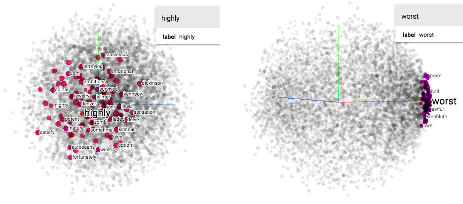
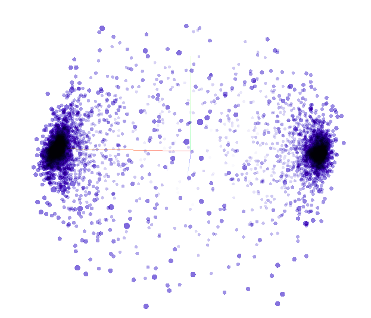

Deep Learning with TensorFlow - Natural Language Processing (NLP) - Tutorials
================
Codes courtesy from TensorFlow in Practice Specialization by deeplearning.ai on Coursera, modified by Tran Nguyen

-   [1. Text Processing with Tokenizer:](#text-processing-with-tokenizer)
-   [2.Text Processing for .json Data:](#text-processing-for-.json-data)
-   [3. Tokenizing the BBC News Dataset:](#tokenizing-the-bbc-news-dataset)
-   [4. NLP with IMDB Dataset](#nlp-with-imdb-dataset)
-   [5. Word Sentiment Visualization with Embedding Projector](#word-sentiment-visualization-with-embedding-projector)
-   [6. NLP with Sarcasm Dataset](#nlp-with-sarcasm-dataset)

Quick notes from the courses + codes to run in Mac terminal. If you want to learn more about TensorFlow, check out the great courses in the "TensorFlow in Practice Specialization" by deeplearning.ai on Coursera.

The codes work well with TensorFlow 2.0

``` bash
pip install tensorflow==2.0.0-alpha0
```

Ref: <https://keras.io/preprocessing/text/>

#### 1. Text Processing with Tokenizer:

-   Codes: tokenizer\_basics.py
-   What you will learn: (i) Generating a corpus from a list of sentences using Tokenizer. (ii) Converting a list of sentences into a sequence of word index from the corpus. (iii) Using padding to get the list of all the sequences that have the same size.

#### 2.Text Processing for .json Data:

-   Codes: text\_processing\_json.py
-   What you will learn: (i) Getting data from json file and tokenize the dataset.

#### 3. Tokenizing the BBC News Dataset:

-   Codes: text\_processing\_bcc\_data.py
-   Input: a folder 'bbc' contains 5 folders of 5 different classes (business, entertainment, politics, sport, tech). Each class has mutiple text files of news.
-   Ouput: a corpus for each class, and all the sequences of word-index generated from specific corpus for each of the 5 classes.
-   What you will learn: (i) Reading multiple files from folder. (ii) Tokenizing a dataset with removing a list of common stopwords.
-   Stopwords: common words, do not contribute to the meaning of a sentence =&gt; should be filtered out from the sentences before processing. Stopword list is usually customized for each specific problem.

#### 4. NLP with IMDB Dataset

-   Codes: NLP\_imdb\_dataset.py
-   What you will learn: (i) loading data from tensorflow\_datasets (ii) Tokenizing the dataset of movie reviews. (iii) Embeddings the data to establish meaning of word in a mathematical way: Words were mapped to vectors in higher dimensional space, and the semantics of the words then learned when those words were labelled with similar meaning.E.g., embedding\_dim = 16 =&gt; every word is mapped to a vector in a 16-dimensional space (a vector with 16 elements). (iv) Export the tsv file of words and their vectors for visualization with Embedding Projector, an online tools for word sentiment visualization. meta.tsv contains all the common words; and the vector.tsv contains these words' multidemensional vectors, respectively.

#### 5. Word Sentiment Visualization with Embedding Projector

-   Codes: Input files obtained from Session 4.
-   What you will learn:
-   Embedding Projector can be access through <https://projector.tensorflow.org/>.
-   Click `Load` to load the tsv file of vectors and tsv file of metadata.
-   Click `Sphereize data` to visualize the word sentiment.
-   The dimensionalities of the "positive"" sentiment words "point" to a particular way, whereas those with "negative"" sentiment "point" in a different direction.



#### 6. NLP with Sarcasm Dataset

-   Codes: NLP\_sarcasm\_dataset.py
-   What you will learn: (i) Practicing all the concepts mentioned above. (ii) Plotting loss and accuracy. (ii) Perform prediction on a specific sentence.

-   When using number of epochs = 30, for this dataset, the result looks good: All the words in the corpus were classified well as showed in the Embedding Projector:


